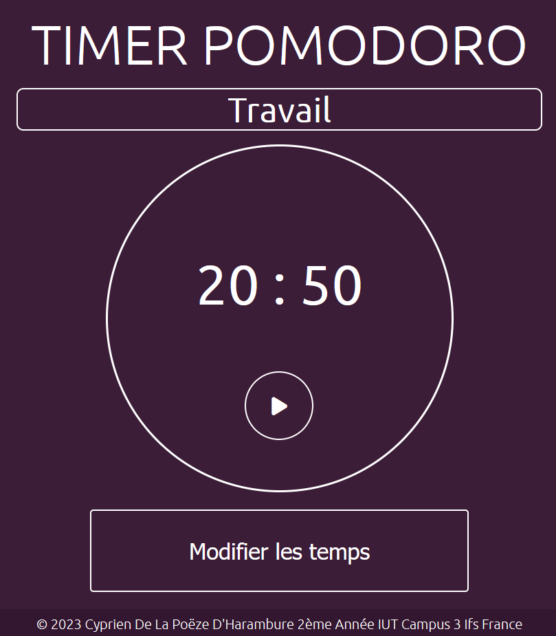

# 🍅 Chronomètre Pomodoro Web 🕒

Bienvenue dans l'application Web du chronomètre Pomodoro ! 🚀

## Qu'est-ce que c'est ❓

Ce chronomètre est conçu pour vous aider à rester concentré et à gérer efficacement votre temps de travail en utilisant la méthode Pomodoro. Il vous permet de définir des périodes de travail et de pause, puis de lancer et de réinitialiser le timer en fonction de vos besoins. C'est un outil simple, mais efficace, pour améliorer votre productivité.

## Fonctionnalités ✨

- ⏳ Réglez la durée de votre période de travail et de votre pause à l'aide d'inputs conviviaux.
- ▶️ Lancez le timer pour commencer votre session de travail.
- 🔄 Réinitialisez le timer à tout moment pour recommencer votre session.
- 📈 Suivez votre progression et restez concentré grâce à la méthode Pomodoro.

## Comment utiliser l'application 📝

1. Ouvrez l'application dans votre navigateur Web préféré.

2. Utilisez les inputs pour définir la durée de votre période de travail (par exemple, 25 minutes) et la durée de votre pause (par exemple, 5 minutes).

3. Cliquez sur le bouton en flèche pour lancer le timer. Vous pouvez également cliquer sur le carré à tout moment pour recommencer votre session.

4. Pendant la période de travail, travaillez intensément sur votre tâche.

5. Lorsque le timer atteint zéro, la couleur de l'écran vous indiquera de prendre une pause. Profitez de votre pause pour vous détendre.

6. Répétez le processus autant de fois que vous le souhaitez pour rester productif et concentré.

## Captures d'écran 📸

## Développement 💻

Si vous souhaitez contribuer au développement de cette application, voici comment commencer :

1. Clonez ce dépôt : `git clone https://github.com/Firim4r/Pomodoro.git`

2. Contribuez en améliorant le code ou en ajoutant de nouvelles fonctionnalités.

## Auteur 👤

👤 Cyprien De La Poëze D'Harambure
- GitHub : [@Firim4r ](https://github.com/Firim4r)

N'hésitez pas à signaler des problèmes ou à proposer des améliorations en ouvrant une issue sur ce dépôt.
